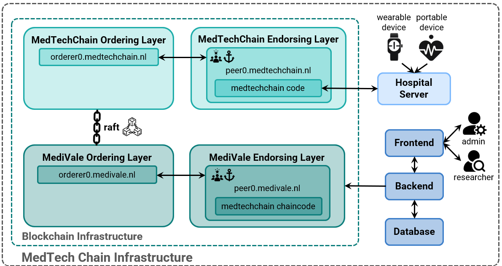

# MedTech Chain

[**MedTech Chain**](https://zenodo.org/records/13384910) is a decentralized, privacy-preserving platform for the secure analysis of medical device data. Built on Hyperledger Fabric, enhanced with ε-differential privacy and homomorphic encryption, it enables hospitals and researchers to analyze data without compromising privacy or security.

---

## Project Overview

MedTech Chain addresses the cybersecurity and privacy challenges in managing networked medical devices. Using blockchain for secure, immutable data storage and advanced privacy techniques, it allows for controlled data analysis that supports medical research and hospital management without exposing sensitive information.

---

## Key Components

### Blockchain and Privacy Framework

- **Permissioned Blockchain**: Hyperledger Fabric enforces access control, ensuring only authenticated participants (e.g., hospitals, researchers) can interact with the data.
- **Differential Privacy (ε-Differential Privacy)**: Smart contracts introduce controlled noise to queries, preventing the extraction and inference of sensitive details.
- **Homomorphic Encryption**: Enables computations on encrypted data within smart contracts, adding an extra layer of privacy by ensuring raw data is never exposed, not even to network participants.

### Core Functionality

MedTech Chain offers customizable queries that are privacy-preserving by design:
   - **Count**: Returns the number of devices based on chosen filters (e.g., hospital, device type).
   - **Grouped Count**: Aggregates device data by specific attributes, such as medical speciality, with visualization.
   - **Average**: Calculates averages of specific metrics, like battery level, for filtered groups.

---

## System Architecture

*Figure 1: MedTech Chain architecture showing the data flow between hospitals, blockchain nodes, and the MedTech Chain organization. (Note: Database here was used only for user management.)*

In this architecture:
- **Hospitals** provide device data to the blockchain.
- **MedTech Chain Organization** manages query requests, adding differential privacy and enforcing access policies.

Each transaction follows a secure, multi-step process through endorsers and orderers in Hyperledger Fabric, ensuring data integrity and privacy.

---

## User Interface

MedTech Chain's interface is designed for ease of use and security. Developed with React and Spring Boot for the backend, it provides distinct views for researchers and administrators.

*Figure 2: User-friendly interface for querying and visualizing device data securely.*

- **Researcher Dashboard**: Supports easy query setup, filter selection, and visual results for intuitive data exploration.
- **Admin Console**: Manages researcher access, permissions, and platform configuration.

---

## Key Technical Aspects

1. **Hyperledger Fabric**: Permissioned blockchain with Raft consensus for secure, decentralized data management.
2. **Differential Privacy in Smart Contracts**: Controlled noise addition directly within queries. The implementation relies on [Google's Differential Privacy Library](https://github.com/google/differential-privacy)
3. **Homomorphic Encryption**: Allows encrypted data processing, safeguarding privacy throughout data analysis. The implementation relies on the Paillier encryption scheme via [kzen-paillier](https://crates.io/crates/kzen-paillier).
4. **Protocol Buffers Data Schema**: Extensible, platform-neutral schema for consistent data across all network nodes.
5. **Dockerized Deployment**: Flexible and scalable infrastructure with containerized components.

---

## Repository Overview

1. **backend**: Implements the User Management Server, facilitating the creation, retrieval, updating, and deletion of researcher profiles. Authenticated researchers can perform queries on the Hyperledger Fabric Blockchain through this service. :contentReference[oaicite:0]{index=0}

2. **frontend**: Develops the user interface for the MedTech Chain platform, providing functionalities for authentication, user management, and device data analysis. The interface uses Next.js and React. :contentReference[oaicite:1]{index=1}

3. **tools**: Contains scripts and configurations for setting up and managing the blockchain infrastructure, including deployment scripts for the Hyperledger Fabric network and chaincode. It also provides utilities for handling dependencies and environment configurations. :contentReference[oaicite:2]{index=2}

4. **hospital**: Represents the hospital server component, responsible for integrating hospital systems with the MedTech Chain network. It manages the secure transmission of medical device data to the blockchain and ensures compliance with privacy protocols. :contentReference[oaicite:3]{index=3}

5. **chaincode**: Contains the smart contracts that define the business logic for data interactions on the blockchain. This includes implementations of privacy-preserving queries and enforcement of access controls. :contentReference[oaicite:4]{index=4}

6. **protos**: Holds the Protocol Buffer (Protobuf) definitions used across the platform for structured data and service interface definitions. It includes a Makefile to simplify common development tasks such as compiling Protobuf files and generating language-specific bindings. :contentReference[oaicite:5]{index=5}

7. **ttp**: Implements the Trusted Third Party (TTP) component (mock), which plays a role in the platform's key management and encryption schemes (especially for homomorphic encryption). It ensures that cryptographic operations are handled securely and interacts with the blockchain to ensure query filtering and homomorphically aggregated result decryption.

8. **encryption**: Export Paillier encryption as an executable to later use within the platform.

---

## Demonstrations and Recognition

MedTech Chain has been showcased at major conferences and awarded for its innovation in privacy-preserving medical data management:

- **Best Demo Award** at [BRAINS 2024](https://brains.dnac.org/2024/)
- Presentations at **Dutch Blockchain Coalition (DBC 2024)** and **IEEE WIFS 2024**
- Supported by the European Union’s **Horizon Europe** research and innovation programme under grant agreement No. 101094901 ([SEPTON](https://septon-project.eu/))

---

## Contribute to MedTech Chain

We welcome contributions from the community! Explore our repositories [GitHub organization](https://github.com/MedTechChain).

---

## Reference Links

- [MedTech Chain Paper on Zenodo](https://zenodo.org/records/13384910)
- [Hyperledger Fabric Documentation](https://hyperledger-fabric.readthedocs.io/en/release-2.2/)
- [Differential Privacy Overview](https://privacytools.seas.harvard.edu/differential-privacy)

## License

All code is released under the MIT license:

MIT License

Copyright (c) 2024 Alin Petru-Rosu, Tamara Tataru, Jegor Zelenjak, 
Roland Kromes, Zekeriya Erkin

Permission is hereby granted, free of charge, to any person obtaining a copy
of this software and associated documentation files (the "Software"), to deal
in the Software without restriction, including without limitation the rights
to use, copy, modify, merge, publish, distribute, sublicense, and/or sell
copies of the Software, and to permit persons to whom the Software is
furnished to do so, subject to the following conditions:

The above copyright notice and this permission notice shall be included in all
copies or substantial portions of the Software.

THE SOFTWARE IS PROVIDED "AS IS", WITHOUT WARRANTY OF ANY KIND, EXPRESS OR
IMPLIED, INCLUDING BUT NOT LIMITED TO THE WARRANTIES OF MERCHANTABILITY,
FITNESS FOR A PARTICULAR PURPOSE AND NONINFRINGEMENT. IN NO EVENT SHALL THE
AUTHORS OR COPYRIGHT HOLDERS BE LIABLE FOR ANY CLAIM, DAMAGES OR OTHER
LIABILITY, WHETHER IN AN ACTION OF CONTRACT, TORT OR OTHERWISE, ARISING FROM,
OUT OF OR IN CONNECTION WITH THE SOFTWARE OR THE USE OR OTHER DEALINGS IN THE
SOFTWARE.
